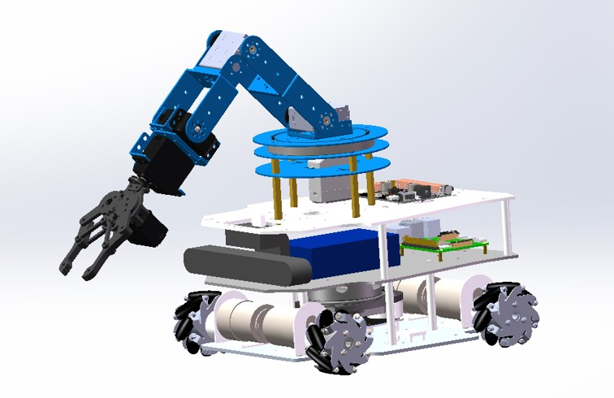
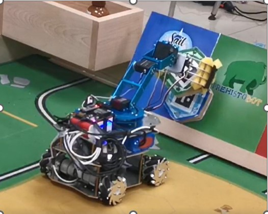
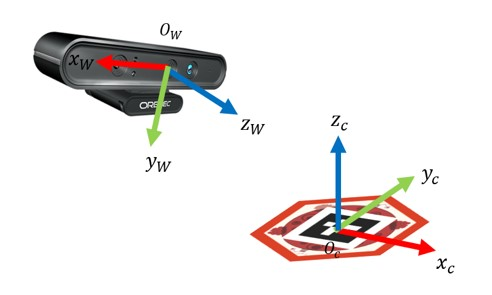
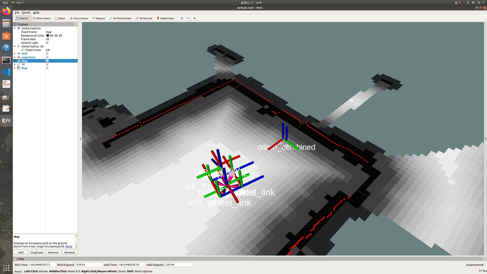
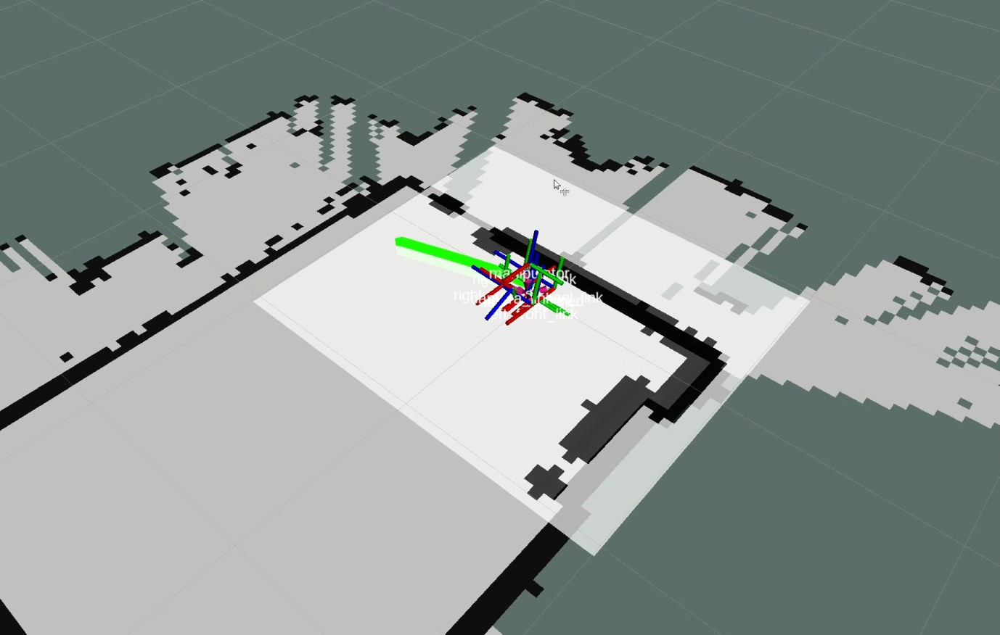
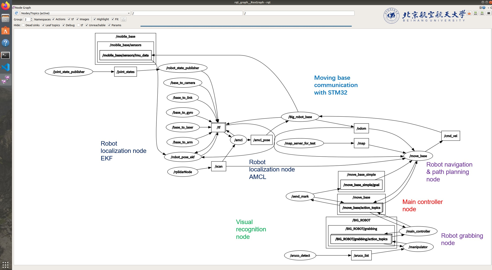

# BSc thesis: EUROBOT competition 2022

# Dependencies
- [ROS Navigation Stack](http://wiki.ros.org/navigation)
- [Robot Pose EKF](http://wiki.ros.org/robot_pose_ekf)
# Contribution
- pkg capstone_manipulator/ & aruco_detect/: a grabbing system based on QR code detection

- pkg main_controller/: define working flows of competition, using ROS::ACTION to define and achieve manipulating and moving tasks
- deployed Extended kalman filter localization, AMCL particle localization on this robot.

- deployed Dijkstra (global planner) and TEB(local planner) algorthim to plan trajectory.

- Overall control system design
